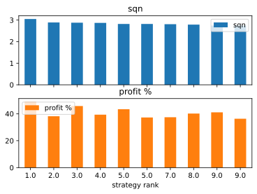
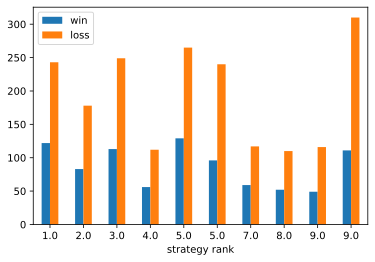

1. [Introduction and Roadmap](#introduction)
2. [Code review](#review)
3. [Best strategies](#strategies)
    1. [Binance historical data (08/17/2017 - 12/25/2020)](#alltime)
    2. [No bullrun phase (03/01/2018 - 11/15/2020)](#nobullrun)
    3. [Save strategies](#save)
4. [Global analysis](#analyse)

# Introduction and Roadmap <a name="introduction"></a>

First, our goal is to backtest several trading strategy on different cryptocurrencies and timeframes and rank them according their profit return. We won't bother developping a complex strategy, we will stick to basics ones using SMA and RSI relying on the Ta-Lib library and backtrader and we will vary the period used between 10 and 30. [backtesting code](backtest.py) | [requirements needed](requirements.txt)

The cryptocurrencies datas needed are collected through the Binance API. [code to get the wanted kandlesticks](get_data.py) | [file containing this datas](data/)

These datas will be processed by the [get_result.py](get_result.py) code that will run through all the datas in the data file and save the result in [result/](result/).

Finally the top 10 strategies will be saved to a [JSON file](top10sqn.json) so that we may reuse them. 

*Later, the algorithm will be adapted for trading futures and the strategies will be improved. The bot will then be connected to Binance and take automatic positions according the best strategy returned by the backtest.*

*Ideally, the backtest will run automatically each X period and reset the best strategy.*

# Code review <a name="review"></a>

Write the code review here

# Best strategies <a name="strategies"></a>


```python
import pandas as pd
import os
```

We will now collect all the results into one dataframe to easily compare the strategies.


```python
df = pd.DataFrame()

for result in os.listdir("./result"):
    result = 'result/' + result
    temp = pd.read_csv(result)
    df = pd.concat([df, temp])
```

To evaluate our strategy we will use Van's System Quality Number (SQN) which is one of the many indicators designed to assist traders in determining the strengths, desirability, quality etc of a trading system. The idea behind SQN is to use it to find good quality strategies. And a good quality strategy is seen as one that is both tradable (is it easy, or is it difficult to trade) and efficient (does it make good money when a money management strategy is applied).

The following values suggest the following “qualities” :

* 1.6 - 1.9 Below average
* 2.0 - 2.4 Average
* 2.5 - 2.9 Good
* 3.0 - 5.0 Excellent
* 5.1 - 6.9 Superb
* 7.0 - Holy Grail

The formula : 
* SquareRoot(NumberTrades) * Average(TradesProfit) / StdDev(TradesProfit)

The sqn value should be deemed reliable when the number of trades **>= 30**

Therefore we will remove all line with a total trades less than 30.


```python
df_result = df.loc[(df['Total win'] + df['Total loss']) >= 30]
```

And then sort the dataframe according their rank.


```python
df_alltime = df_result.sort_values('SQN', ascending=False)
df_alltime['Rank'] = df_alltime['SQN'].rank(method='min', ascending=False)
```

## Binance historical data (08/17/2017 - 12/25/2020) <a name="alltime"></a>


```python
topSQN = df_alltime.head(10)

topSqnSqn = list(topSQN['SQN'])
topSqnProfit = list(round(topSQN['%'],3))
topSqnWin = list(topSQN['Total win'])
topSqnLoss = list(topSQN['Total loss'])
index = list(topSQN['Rank'])

topSQN
```


<div>

<style scoped>
.dataframe tbody tr th:only-of-type {
    vertical-align: middle;
}

.dataframe tbody tr th {
    vertical-align: top;
}

.dataframe thead th {
    text-align: right;
}
</style>
<table border="1" class="dataframe">
  <thead>
    <tr style="text-align: right;">
      <th></th>
      <th>Pair</th>
      <th>Timeframe</th>
      <th>Start</th>
      <th>End</th>
      <th>Strategy</th>
      <th>Period</th>
      <th>Final value</th>
      <th>%</th>
      <th>Total win</th>
      <th>Total loss</th>
      <th>SQN</th>
      <th>Rank</th>
    </tr>
  </thead>
  <tbody>
    <tr>
      <th>1</th>
      <td>ETHUSDT</td>
      <td>6h</td>
      <td>2017-01-01</td>
      <td>2020-12-31</td>
      <td>SMA</td>
      <td>11</td>
      <td>14874.364</td>
      <td>48.824</td>
      <td>122</td>
      <td>243</td>
      <td>3.05</td>
      <td>1.0</td>
    </tr>
    <tr>
      <th>2</th>
      <td>BTCUSDT</td>
      <td>8h</td>
      <td>2017-01-01</td>
      <td>2020-12-31</td>
      <td>SMA</td>
      <td>12</td>
      <td>13813.646</td>
      <td>38.188</td>
      <td>83</td>
      <td>178</td>
      <td>2.89</td>
      <td>2.0</td>
    </tr>
    <tr>
      <th>2</th>
      <td>ETHUSDT</td>
      <td>6h</td>
      <td>2017-01-01</td>
      <td>2020-12-31</td>
      <td>SMA</td>
      <td>12</td>
      <td>14564.124</td>
      <td>45.720</td>
      <td>113</td>
      <td>249</td>
      <td>2.88</td>
      <td>3.0</td>
    </tr>
    <tr>
      <th>1</th>
      <td>BTCUSDT</td>
      <td>12h</td>
      <td>2017-01-01</td>
      <td>2020-12-31</td>
      <td>SMA</td>
      <td>11</td>
      <td>13937.049</td>
      <td>39.309</td>
      <td>56</td>
      <td>112</td>
      <td>2.87</td>
      <td>4.0</td>
    </tr>
    <tr>
      <th>0</th>
      <td>ETHUSDT</td>
      <td>6h</td>
      <td>2017-01-01</td>
      <td>2020-12-31</td>
      <td>SMA</td>
      <td>10</td>
      <td>14330.644</td>
      <td>43.384</td>
      <td>129</td>
      <td>265</td>
      <td>2.82</td>
      <td>5.0</td>
    </tr>
    <tr>
      <th>3</th>
      <td>BTCUSDT</td>
      <td>6h</td>
      <td>2017-01-01</td>
      <td>2020-12-31</td>
      <td>SMA</td>
      <td>13</td>
      <td>13745.854</td>
      <td>37.239</td>
      <td>96</td>
      <td>240</td>
      <td>2.82</td>
      <td>5.0</td>
    </tr>
    <tr>
      <th>0</th>
      <td>BTCUSDT</td>
      <td>12h</td>
      <td>2017-01-01</td>
      <td>2020-12-31</td>
      <td>SMA</td>
      <td>10</td>
      <td>13747.955</td>
      <td>37.419</td>
      <td>59</td>
      <td>117</td>
      <td>2.81</td>
      <td>7.0</td>
    </tr>
    <tr>
      <th>2</th>
      <td>BTCUSDT</td>
      <td>12h</td>
      <td>2017-01-01</td>
      <td>2020-12-31</td>
      <td>SMA</td>
      <td>12</td>
      <td>14021.213</td>
      <td>40.150</td>
      <td>52</td>
      <td>110</td>
      <td>2.79</td>
      <td>8.0</td>
    </tr>
    <tr>
      <th>12</th>
      <td>BTCUSDT</td>
      <td>8h</td>
      <td>2017-01-01</td>
      <td>2020-12-31</td>
      <td>SMA</td>
      <td>22</td>
      <td>14099.781</td>
      <td>41.051</td>
      <td>49</td>
      <td>116</td>
      <td>2.75</td>
      <td>9.0</td>
    </tr>
    <tr>
      <th>8</th>
      <td>BTCUSDT</td>
      <td>4h</td>
      <td>2017-01-01</td>
      <td>2020-12-31</td>
      <td>SMA</td>
      <td>18</td>
      <td>13649.596</td>
      <td>36.320</td>
      <td>111</td>
      <td>310</td>
      <td>2.75</td>
      <td>9.0</td>
    </tr>
  </tbody>
</table>

</div>


In our top 10 best strategies return we have 1 excellent System Quality Number, all the rests are good. 

We have mainly BTCUSDT pair traded however, the only 3 strategy in that top10 that traded ETHUSDT are listed in the top 5 best sqn (and even top 1 with an excellent sqn > 3).

Surprisingly, our SMA strategy succedeed far better than our RSI. This might be explained by the fact that the RSI has taken less than 30 positions on "high" dataframe (> 4h). 

The few positions taken are not even sucessfull for the majority :


```python
tfhigh_rsi = df_alltime.loc[(df_alltime['Strategy'] == 'RSI') & ((df_alltime['Timeframe'] == '6h') | (df_alltime['Timeframe'] == '8h') | (df_alltime['Timeframe'] == '12h') | (df_alltime['Timeframe'] == '1w'))]

tfhigh_rsi
```


<div>
<style scoped>
    .dataframe tbody tr th:only-of-type {
        vertical-align: middle;
    }

    .dataframe tbody tr th {
        vertical-align: top;
    }

    .dataframe thead th {
        text-align: right;
    }
</style>
<table border="1" class="dataframe">
  <thead>
    <tr style="text-align: right;">
      <th></th>
      <th>Pair</th>
      <th>Timeframe</th>
      <th>Start</th>
      <th>End</th>
      <th>Strategy</th>
      <th>Period</th>
      <th>Final value</th>
      <th>%</th>
      <th>Total win</th>
      <th>Total loss</th>
      <th>SQN</th>
      <th>Rank</th>
    </tr>
  </thead>
  <tbody>
    <tr>
      <th>2</th>
      <td>BTCUSDT</td>
      <td>6h</td>
      <td>2017-01-01</td>
      <td>2020-12-31</td>
      <td>RSI</td>
      <td>12</td>
      <td>10325.354</td>
      <td>3.254</td>
      <td>22</td>
      <td>9</td>
      <td>0.40</td>
      <td>507.0</td>
    </tr>
    <tr>
      <th>1</th>
      <td>BTCUSDT</td>
      <td>6h</td>
      <td>2017-01-01</td>
      <td>2020-12-31</td>
      <td>RSI</td>
      <td>11</td>
      <td>9857.332</td>
      <td>-1.427</td>
      <td>23</td>
      <td>10</td>
      <td>-0.18</td>
      <td>584.0</td>
    </tr>
    <tr>
      <th>0</th>
      <td>ETHUSDT</td>
      <td>6h</td>
      <td>2017-01-01</td>
      <td>2020-12-31</td>
      <td>RSI</td>
      <td>10</td>
      <td>9315.605</td>
      <td>-6.844</td>
      <td>21</td>
      <td>13</td>
      <td>-0.63</td>
      <td>668.0</td>
    </tr>
    <tr>
      <th>0</th>
      <td>BTCUSDT</td>
      <td>6h</td>
      <td>2017-01-01</td>
      <td>2020-12-31</td>
      <td>RSI</td>
      <td>10</td>
      <td>9469.514</td>
      <td>-5.305</td>
      <td>23</td>
      <td>12</td>
      <td>-0.70</td>
      <td>683.0</td>
    </tr>
  </tbody>
</table>
</div>


Back to our top 10, we notice that we have many values of period near 10 which means we might have unfortunately missed some good strategy using period < 10. This is something to take into account next time we run our code.

We can also notice that a better sqn doesn't necessary mean better profit as the next charts can illustrates :


```python
topSqnBars = pd.DataFrame({'sqn': topSqnSqn, 'profit %': topSqnProfit}, index=index)
topSqnBars.index.name = 'strategy rank'
topSqnBarsSplit = topSqnBars.plot.bar(rot=0, subplots=True)
topSqnBarsSplit[1].legend(loc=2);
```


    

    


What's interesting is to see that all our top strategies made at least 2x more negatives trades than positives, nevertheless the final results remains positive. This mean we have a good ratio per trade, in other words for 1 winning trade we can expect to lose *x* times before having a final outcome of 0 since our one profit was either too big, or our losses too small.


```python
topSqnBars2 = pd.DataFrame({'win': topSqnWin, 'loss': topSqnLoss}, index=index)
topSqnBars2.index.name = 'strategy rank'
topSqnBars2.plot.bar(rot=0);
```


    

    


This really good ratio per trade may be the result of the bullrun that occured in 2017 and end November/start of December 2020 which might have results in big gains. 

This assumptions can be backed with the fact that all our top strategies were applied to our historical data that includes the bullrun period (08/17/2017 - 12/25/2020).

Let's see and compare with what we will get if we remove the bullrun period.

## No bullrun phase (03/01/2018 - 11/15/2020) <a name="nobullrun"></a>


```python
df_nobullrun = df_result.loc[df_result['Start'] == '2018-03-01'].sort_values('SQN', ascending=False)
df_nobullrun['Rank'] = df_nobullrun['SQN'].rank(method='min', ascending=False)

topNoBullrun = df_nobullrun.head(10)
```


```python
def sameETHTop(s):
    """
    Display in a different color the strategies on ETHUSDT pair already present in our previous all time top 10.
    """
    if (s['Pair'] == 'ETHUSDT' and s['Timeframe'] == '6h' and s['Strategy'] == 'SMA') and (s['Period'] == 11 or s['Period'] == 12 or s['Period'] == 10):
        return ['color: yellow']*s.size
    else:
        return ['background-color: default']*s.size
        
topNoBullrun.reset_index(drop=True).style.apply(sameETHTop, axis=1)
```


<style  type="text/css" >
#T_be4d901a_4f95_11eb_b063_106530f419farow0_col0,#T_be4d901a_4f95_11eb_b063_106530f419farow0_col1,#T_be4d901a_4f95_11eb_b063_106530f419farow0_col2,#T_be4d901a_4f95_11eb_b063_106530f419farow0_col3,#T_be4d901a_4f95_11eb_b063_106530f419farow0_col4,#T_be4d901a_4f95_11eb_b063_106530f419farow0_col5,#T_be4d901a_4f95_11eb_b063_106530f419farow0_col6,#T_be4d901a_4f95_11eb_b063_106530f419farow0_col7,#T_be4d901a_4f95_11eb_b063_106530f419farow0_col8,#T_be4d901a_4f95_11eb_b063_106530f419farow0_col9,#T_be4d901a_4f95_11eb_b063_106530f419farow0_col10,#T_be4d901a_4f95_11eb_b063_106530f419farow0_col11,#T_be4d901a_4f95_11eb_b063_106530f419farow1_col0,#T_be4d901a_4f95_11eb_b063_106530f419farow1_col1,#T_be4d901a_4f95_11eb_b063_106530f419farow1_col2,#T_be4d901a_4f95_11eb_b063_106530f419farow1_col3,#T_be4d901a_4f95_11eb_b063_106530f419farow1_col4,#T_be4d901a_4f95_11eb_b063_106530f419farow1_col5,#T_be4d901a_4f95_11eb_b063_106530f419farow1_col6,#T_be4d901a_4f95_11eb_b063_106530f419farow1_col7,#T_be4d901a_4f95_11eb_b063_106530f419farow1_col8,#T_be4d901a_4f95_11eb_b063_106530f419farow1_col9,#T_be4d901a_4f95_11eb_b063_106530f419farow1_col10,#T_be4d901a_4f95_11eb_b063_106530f419farow1_col11,#T_be4d901a_4f95_11eb_b063_106530f419farow3_col0,#T_be4d901a_4f95_11eb_b063_106530f419farow3_col1,#T_be4d901a_4f95_11eb_b063_106530f419farow3_col2,#T_be4d901a_4f95_11eb_b063_106530f419farow3_col3,#T_be4d901a_4f95_11eb_b063_106530f419farow3_col4,#T_be4d901a_4f95_11eb_b063_106530f419farow3_col5,#T_be4d901a_4f95_11eb_b063_106530f419farow3_col6,#T_be4d901a_4f95_11eb_b063_106530f419farow3_col7,#T_be4d901a_4f95_11eb_b063_106530f419farow3_col8,#T_be4d901a_4f95_11eb_b063_106530f419farow3_col9,#T_be4d901a_4f95_11eb_b063_106530f419farow3_col10,#T_be4d901a_4f95_11eb_b063_106530f419farow3_col11,#T_be4d901a_4f95_11eb_b063_106530f419farow5_col0,#T_be4d901a_4f95_11eb_b063_106530f419farow5_col1,#T_be4d901a_4f95_11eb_b063_106530f419farow5_col2,#T_be4d901a_4f95_11eb_b063_106530f419farow5_col3,#T_be4d901a_4f95_11eb_b063_106530f419farow5_col4,#T_be4d901a_4f95_11eb_b063_106530f419farow5_col5,#T_be4d901a_4f95_11eb_b063_106530f419farow5_col6,#T_be4d901a_4f95_11eb_b063_106530f419farow5_col7,#T_be4d901a_4f95_11eb_b063_106530f419farow5_col8,#T_be4d901a_4f95_11eb_b063_106530f419farow5_col9,#T_be4d901a_4f95_11eb_b063_106530f419farow5_col10,#T_be4d901a_4f95_11eb_b063_106530f419farow5_col11,#T_be4d901a_4f95_11eb_b063_106530f419farow6_col0,#T_be4d901a_4f95_11eb_b063_106530f419farow6_col1,#T_be4d901a_4f95_11eb_b063_106530f419farow6_col2,#T_be4d901a_4f95_11eb_b063_106530f419farow6_col3,#T_be4d901a_4f95_11eb_b063_106530f419farow6_col4,#T_be4d901a_4f95_11eb_b063_106530f419farow6_col5,#T_be4d901a_4f95_11eb_b063_106530f419farow6_col6,#T_be4d901a_4f95_11eb_b063_106530f419farow6_col7,#T_be4d901a_4f95_11eb_b063_106530f419farow6_col8,#T_be4d901a_4f95_11eb_b063_106530f419farow6_col9,#T_be4d901a_4f95_11eb_b063_106530f419farow6_col10,#T_be4d901a_4f95_11eb_b063_106530f419farow6_col11,#T_be4d901a_4f95_11eb_b063_106530f419farow8_col0,#T_be4d901a_4f95_11eb_b063_106530f419farow8_col1,#T_be4d901a_4f95_11eb_b063_106530f419farow8_col2,#T_be4d901a_4f95_11eb_b063_106530f419farow8_col3,#T_be4d901a_4f95_11eb_b063_106530f419farow8_col4,#T_be4d901a_4f95_11eb_b063_106530f419farow8_col5,#T_be4d901a_4f95_11eb_b063_106530f419farow8_col6,#T_be4d901a_4f95_11eb_b063_106530f419farow8_col7,#T_be4d901a_4f95_11eb_b063_106530f419farow8_col8,#T_be4d901a_4f95_11eb_b063_106530f419farow8_col9,#T_be4d901a_4f95_11eb_b063_106530f419farow8_col10,#T_be4d901a_4f95_11eb_b063_106530f419farow8_col11,#T_be4d901a_4f95_11eb_b063_106530f419farow9_col0,#T_be4d901a_4f95_11eb_b063_106530f419farow9_col1,#T_be4d901a_4f95_11eb_b063_106530f419farow9_col2,#T_be4d901a_4f95_11eb_b063_106530f419farow9_col3,#T_be4d901a_4f95_11eb_b063_106530f419farow9_col4,#T_be4d901a_4f95_11eb_b063_106530f419farow9_col5,#T_be4d901a_4f95_11eb_b063_106530f419farow9_col6,#T_be4d901a_4f95_11eb_b063_106530f419farow9_col7,#T_be4d901a_4f95_11eb_b063_106530f419farow9_col8,#T_be4d901a_4f95_11eb_b063_106530f419farow9_col9,#T_be4d901a_4f95_11eb_b063_106530f419farow9_col10,#T_be4d901a_4f95_11eb_b063_106530f419farow9_col11{
            background-color:  default;
        }#T_be4d901a_4f95_11eb_b063_106530f419farow2_col0,#T_be4d901a_4f95_11eb_b063_106530f419farow2_col1,#T_be4d901a_4f95_11eb_b063_106530f419farow2_col2,#T_be4d901a_4f95_11eb_b063_106530f419farow2_col3,#T_be4d901a_4f95_11eb_b063_106530f419farow2_col4,#T_be4d901a_4f95_11eb_b063_106530f419farow2_col5,#T_be4d901a_4f95_11eb_b063_106530f419farow2_col6,#T_be4d901a_4f95_11eb_b063_106530f419farow2_col7,#T_be4d901a_4f95_11eb_b063_106530f419farow2_col8,#T_be4d901a_4f95_11eb_b063_106530f419farow2_col9,#T_be4d901a_4f95_11eb_b063_106530f419farow2_col10,#T_be4d901a_4f95_11eb_b063_106530f419farow2_col11,#T_be4d901a_4f95_11eb_b063_106530f419farow4_col0,#T_be4d901a_4f95_11eb_b063_106530f419farow4_col1,#T_be4d901a_4f95_11eb_b063_106530f419farow4_col2,#T_be4d901a_4f95_11eb_b063_106530f419farow4_col3,#T_be4d901a_4f95_11eb_b063_106530f419farow4_col4,#T_be4d901a_4f95_11eb_b063_106530f419farow4_col5,#T_be4d901a_4f95_11eb_b063_106530f419farow4_col6,#T_be4d901a_4f95_11eb_b063_106530f419farow4_col7,#T_be4d901a_4f95_11eb_b063_106530f419farow4_col8,#T_be4d901a_4f95_11eb_b063_106530f419farow4_col9,#T_be4d901a_4f95_11eb_b063_106530f419farow4_col10,#T_be4d901a_4f95_11eb_b063_106530f419farow4_col11,#T_be4d901a_4f95_11eb_b063_106530f419farow7_col0,#T_be4d901a_4f95_11eb_b063_106530f419farow7_col1,#T_be4d901a_4f95_11eb_b063_106530f419farow7_col2,#T_be4d901a_4f95_11eb_b063_106530f419farow7_col3,#T_be4d901a_4f95_11eb_b063_106530f419farow7_col4,#T_be4d901a_4f95_11eb_b063_106530f419farow7_col5,#T_be4d901a_4f95_11eb_b063_106530f419farow7_col6,#T_be4d901a_4f95_11eb_b063_106530f419farow7_col7,#T_be4d901a_4f95_11eb_b063_106530f419farow7_col8,#T_be4d901a_4f95_11eb_b063_106530f419farow7_col9,#T_be4d901a_4f95_11eb_b063_106530f419farow7_col10,#T_be4d901a_4f95_11eb_b063_106530f419farow7_col11{
            color:  yellow;
        }</style><table id="T_be4d901a_4f95_11eb_b063_106530f419fa" ><thead>    <tr>        <th class="blank level0" ></th>        <th class="col_heading level0 col0" >Pair</th>        <th class="col_heading level0 col1" >Timeframe</th>        <th class="col_heading level0 col2" >Start</th>        <th class="col_heading level0 col3" >End</th>        <th class="col_heading level0 col4" >Strategy</th>        <th class="col_heading level0 col5" >Period</th>        <th class="col_heading level0 col6" >Final value</th>        <th class="col_heading level0 col7" >%</th>        <th class="col_heading level0 col8" >Total win</th>        <th class="col_heading level0 col9" >Total loss</th>        <th class="col_heading level0 col10" >SQN</th>        <th class="col_heading level0 col11" >Rank</th>    </tr></thead><tbody>
                <tr>
                        <th id="T_be4d901a_4f95_11eb_b063_106530f419falevel0_row0" class="row_heading level0 row0" >0</th>
                        <td id="T_be4d901a_4f95_11eb_b063_106530f419farow0_col0" class="data row0 col0" >ETHUSDT</td>
                        <td id="T_be4d901a_4f95_11eb_b063_106530f419farow0_col1" class="data row0 col1" >4h</td>
                        <td id="T_be4d901a_4f95_11eb_b063_106530f419farow0_col2" class="data row0 col2" >2018-03-01</td>
                        <td id="T_be4d901a_4f95_11eb_b063_106530f419farow0_col3" class="data row0 col3" >2020-11-15</td>
                        <td id="T_be4d901a_4f95_11eb_b063_106530f419farow0_col4" class="data row0 col4" >SMA</td>
                        <td id="T_be4d901a_4f95_11eb_b063_106530f419farow0_col5" class="data row0 col5" >17</td>
                        <td id="T_be4d901a_4f95_11eb_b063_106530f419farow0_col6" class="data row0 col6" >12711.644000</td>
                        <td id="T_be4d901a_4f95_11eb_b063_106530f419farow0_col7" class="data row0 col7" >27.116000</td>
                        <td id="T_be4d901a_4f95_11eb_b063_106530f419farow0_col8" class="data row0 col8" >95</td>
                        <td id="T_be4d901a_4f95_11eb_b063_106530f419farow0_col9" class="data row0 col9" >250</td>
                        <td id="T_be4d901a_4f95_11eb_b063_106530f419farow0_col10" class="data row0 col10" >2.420000</td>
                        <td id="T_be4d901a_4f95_11eb_b063_106530f419farow0_col11" class="data row0 col11" >1.000000</td>
            </tr>
            <tr>
                        <th id="T_be4d901a_4f95_11eb_b063_106530f419falevel0_row1" class="row_heading level0 row1" >1</th>
                        <td id="T_be4d901a_4f95_11eb_b063_106530f419farow1_col0" class="data row1 col0" >ETHUSDT</td>
                        <td id="T_be4d901a_4f95_11eb_b063_106530f419farow1_col1" class="data row1 col1" >4h</td>
                        <td id="T_be4d901a_4f95_11eb_b063_106530f419farow1_col2" class="data row1 col2" >2018-03-01</td>
                        <td id="T_be4d901a_4f95_11eb_b063_106530f419farow1_col3" class="data row1 col3" >2020-11-15</td>
                        <td id="T_be4d901a_4f95_11eb_b063_106530f419farow1_col4" class="data row1 col4" >SMA</td>
                        <td id="T_be4d901a_4f95_11eb_b063_106530f419farow1_col5" class="data row1 col5" >15</td>
                        <td id="T_be4d901a_4f95_11eb_b063_106530f419farow1_col6" class="data row1 col6" >12618.773000</td>
                        <td id="T_be4d901a_4f95_11eb_b063_106530f419farow1_col7" class="data row1 col7" >26.188000</td>
                        <td id="T_be4d901a_4f95_11eb_b063_106530f419farow1_col8" class="data row1 col8" >100</td>
                        <td id="T_be4d901a_4f95_11eb_b063_106530f419farow1_col9" class="data row1 col9" >270</td>
                        <td id="T_be4d901a_4f95_11eb_b063_106530f419farow1_col10" class="data row1 col10" >2.380000</td>
                        <td id="T_be4d901a_4f95_11eb_b063_106530f419farow1_col11" class="data row1 col11" >2.000000</td>
            </tr>
            <tr>
                        <th id="T_be4d901a_4f95_11eb_b063_106530f419falevel0_row2" class="row_heading level0 row2" >2</th>
                        <td id="T_be4d901a_4f95_11eb_b063_106530f419farow2_col0" class="data row2 col0" >ETHUSDT</td>
                        <td id="T_be4d901a_4f95_11eb_b063_106530f419farow2_col1" class="data row2 col1" >6h</td>
                        <td id="T_be4d901a_4f95_11eb_b063_106530f419farow2_col2" class="data row2 col2" >2018-03-01</td>
                        <td id="T_be4d901a_4f95_11eb_b063_106530f419farow2_col3" class="data row2 col3" >2020-11-15</td>
                        <td id="T_be4d901a_4f95_11eb_b063_106530f419farow2_col4" class="data row2 col4" >SMA</td>
                        <td id="T_be4d901a_4f95_11eb_b063_106530f419farow2_col5" class="data row2 col5" >11</td>
                        <td id="T_be4d901a_4f95_11eb_b063_106530f419farow2_col6" class="data row2 col6" >12579.214000</td>
                        <td id="T_be4d901a_4f95_11eb_b063_106530f419farow2_col7" class="data row2 col7" >25.792000</td>
                        <td id="T_be4d901a_4f95_11eb_b063_106530f419farow2_col8" class="data row2 col8" >91</td>
                        <td id="T_be4d901a_4f95_11eb_b063_106530f419farow2_col9" class="data row2 col9" >207</td>
                        <td id="T_be4d901a_4f95_11eb_b063_106530f419farow2_col10" class="data row2 col10" >2.350000</td>
                        <td id="T_be4d901a_4f95_11eb_b063_106530f419farow2_col11" class="data row2 col11" >3.000000</td>
            </tr>
            <tr>
                        <th id="T_be4d901a_4f95_11eb_b063_106530f419falevel0_row3" class="row_heading level0 row3" >3</th>
                        <td id="T_be4d901a_4f95_11eb_b063_106530f419farow3_col0" class="data row3 col0" >ETHUSDT</td>
                        <td id="T_be4d901a_4f95_11eb_b063_106530f419farow3_col1" class="data row3 col1" >4h</td>
                        <td id="T_be4d901a_4f95_11eb_b063_106530f419farow3_col2" class="data row3 col2" >2018-03-01</td>
                        <td id="T_be4d901a_4f95_11eb_b063_106530f419farow3_col3" class="data row3 col3" >2020-11-15</td>
                        <td id="T_be4d901a_4f95_11eb_b063_106530f419farow3_col4" class="data row3 col4" >SMA</td>
                        <td id="T_be4d901a_4f95_11eb_b063_106530f419farow3_col5" class="data row3 col5" >18</td>
                        <td id="T_be4d901a_4f95_11eb_b063_106530f419farow3_col6" class="data row3 col6" >12569.414000</td>
                        <td id="T_be4d901a_4f95_11eb_b063_106530f419farow3_col7" class="data row3 col7" >25.694000</td>
                        <td id="T_be4d901a_4f95_11eb_b063_106530f419farow3_col8" class="data row3 col8" >86</td>
                        <td id="T_be4d901a_4f95_11eb_b063_106530f419farow3_col9" class="data row3 col9" >254</td>
                        <td id="T_be4d901a_4f95_11eb_b063_106530f419farow3_col10" class="data row3 col10" >2.220000</td>
                        <td id="T_be4d901a_4f95_11eb_b063_106530f419farow3_col11" class="data row3 col11" >4.000000</td>
            </tr>
            <tr>
                        <th id="T_be4d901a_4f95_11eb_b063_106530f419falevel0_row4" class="row_heading level0 row4" >4</th>
                        <td id="T_be4d901a_4f95_11eb_b063_106530f419farow4_col0" class="data row4 col0" >ETHUSDT</td>
                        <td id="T_be4d901a_4f95_11eb_b063_106530f419farow4_col1" class="data row4 col1" >6h</td>
                        <td id="T_be4d901a_4f95_11eb_b063_106530f419farow4_col2" class="data row4 col2" >2018-03-01</td>
                        <td id="T_be4d901a_4f95_11eb_b063_106530f419farow4_col3" class="data row4 col3" >2020-11-15</td>
                        <td id="T_be4d901a_4f95_11eb_b063_106530f419farow4_col4" class="data row4 col4" >SMA</td>
                        <td id="T_be4d901a_4f95_11eb_b063_106530f419farow4_col5" class="data row4 col5" >12</td>
                        <td id="T_be4d901a_4f95_11eb_b063_106530f419farow4_col6" class="data row4 col6" >12387.524000</td>
                        <td id="T_be4d901a_4f95_11eb_b063_106530f419farow4_col7" class="data row4 col7" >23.875000</td>
                        <td id="T_be4d901a_4f95_11eb_b063_106530f419farow4_col8" class="data row4 col8" >87</td>
                        <td id="T_be4d901a_4f95_11eb_b063_106530f419farow4_col9" class="data row4 col9" >209</td>
                        <td id="T_be4d901a_4f95_11eb_b063_106530f419farow4_col10" class="data row4 col10" >2.210000</td>
                        <td id="T_be4d901a_4f95_11eb_b063_106530f419farow4_col11" class="data row4 col11" >5.000000</td>
            </tr>
            <tr>
                        <th id="T_be4d901a_4f95_11eb_b063_106530f419falevel0_row5" class="row_heading level0 row5" >5</th>
                        <td id="T_be4d901a_4f95_11eb_b063_106530f419farow5_col0" class="data row5 col0" >ETHUSDT</td>
                        <td id="T_be4d901a_4f95_11eb_b063_106530f419farow5_col1" class="data row5 col1" >4h</td>
                        <td id="T_be4d901a_4f95_11eb_b063_106530f419farow5_col2" class="data row5 col2" >2018-03-01</td>
                        <td id="T_be4d901a_4f95_11eb_b063_106530f419farow5_col3" class="data row5 col3" >2020-11-15</td>
                        <td id="T_be4d901a_4f95_11eb_b063_106530f419farow5_col4" class="data row5 col4" >SMA</td>
                        <td id="T_be4d901a_4f95_11eb_b063_106530f419farow5_col5" class="data row5 col5" >14</td>
                        <td id="T_be4d901a_4f95_11eb_b063_106530f419farow5_col6" class="data row5 col6" >12407.632000</td>
                        <td id="T_be4d901a_4f95_11eb_b063_106530f419farow5_col7" class="data row5 col7" >24.076000</td>
                        <td id="T_be4d901a_4f95_11eb_b063_106530f419farow5_col8" class="data row5 col8" >103</td>
                        <td id="T_be4d901a_4f95_11eb_b063_106530f419farow5_col9" class="data row5 col9" >300</td>
                        <td id="T_be4d901a_4f95_11eb_b063_106530f419farow5_col10" class="data row5 col10" >2.200000</td>
                        <td id="T_be4d901a_4f95_11eb_b063_106530f419farow5_col11" class="data row5 col11" >6.000000</td>
            </tr>
            <tr>
                        <th id="T_be4d901a_4f95_11eb_b063_106530f419falevel0_row6" class="row_heading level0 row6" >6</th>
                        <td id="T_be4d901a_4f95_11eb_b063_106530f419farow6_col0" class="data row6 col0" >ETHUSDT</td>
                        <td id="T_be4d901a_4f95_11eb_b063_106530f419farow6_col1" class="data row6 col1" >4h</td>
                        <td id="T_be4d901a_4f95_11eb_b063_106530f419farow6_col2" class="data row6 col2" >2018-03-01</td>
                        <td id="T_be4d901a_4f95_11eb_b063_106530f419farow6_col3" class="data row6 col3" >2020-11-15</td>
                        <td id="T_be4d901a_4f95_11eb_b063_106530f419farow6_col4" class="data row6 col4" >SMA</td>
                        <td id="T_be4d901a_4f95_11eb_b063_106530f419farow6_col5" class="data row6 col5" >16</td>
                        <td id="T_be4d901a_4f95_11eb_b063_106530f419farow6_col6" class="data row6 col6" >12434.159000</td>
                        <td id="T_be4d901a_4f95_11eb_b063_106530f419farow6_col7" class="data row6 col7" >24.342000</td>
                        <td id="T_be4d901a_4f95_11eb_b063_106530f419farow6_col8" class="data row6 col8" >98</td>
                        <td id="T_be4d901a_4f95_11eb_b063_106530f419farow6_col9" class="data row6 col9" >266</td>
                        <td id="T_be4d901a_4f95_11eb_b063_106530f419farow6_col10" class="data row6 col10" >2.190000</td>
                        <td id="T_be4d901a_4f95_11eb_b063_106530f419farow6_col11" class="data row6 col11" >7.000000</td>
            </tr>
            <tr>
                        <th id="T_be4d901a_4f95_11eb_b063_106530f419falevel0_row7" class="row_heading level0 row7" >7</th>
                        <td id="T_be4d901a_4f95_11eb_b063_106530f419farow7_col0" class="data row7 col0" >ETHUSDT</td>
                        <td id="T_be4d901a_4f95_11eb_b063_106530f419farow7_col1" class="data row7 col1" >6h</td>
                        <td id="T_be4d901a_4f95_11eb_b063_106530f419farow7_col2" class="data row7 col2" >2018-03-01</td>
                        <td id="T_be4d901a_4f95_11eb_b063_106530f419farow7_col3" class="data row7 col3" >2020-11-15</td>
                        <td id="T_be4d901a_4f95_11eb_b063_106530f419farow7_col4" class="data row7 col4" >SMA</td>
                        <td id="T_be4d901a_4f95_11eb_b063_106530f419farow7_col5" class="data row7 col5" >10</td>
                        <td id="T_be4d901a_4f95_11eb_b063_106530f419farow7_col6" class="data row7 col6" >12397.067000</td>
                        <td id="T_be4d901a_4f95_11eb_b063_106530f419farow7_col7" class="data row7 col7" >23.971000</td>
                        <td id="T_be4d901a_4f95_11eb_b063_106530f419farow7_col8" class="data row7 col8" >97</td>
                        <td id="T_be4d901a_4f95_11eb_b063_106530f419farow7_col9" class="data row7 col9" >224</td>
                        <td id="T_be4d901a_4f95_11eb_b063_106530f419farow7_col10" class="data row7 col10" >2.180000</td>
                        <td id="T_be4d901a_4f95_11eb_b063_106530f419farow7_col11" class="data row7 col11" >8.000000</td>
            </tr>
            <tr>
                        <th id="T_be4d901a_4f95_11eb_b063_106530f419falevel0_row8" class="row_heading level0 row8" >8</th>
                        <td id="T_be4d901a_4f95_11eb_b063_106530f419farow8_col0" class="data row8 col0" >ETHUSDT</td>
                        <td id="T_be4d901a_4f95_11eb_b063_106530f419farow8_col1" class="data row8 col1" >4h</td>
                        <td id="T_be4d901a_4f95_11eb_b063_106530f419farow8_col2" class="data row8 col2" >2018-03-01</td>
                        <td id="T_be4d901a_4f95_11eb_b063_106530f419farow8_col3" class="data row8 col3" >2020-11-15</td>
                        <td id="T_be4d901a_4f95_11eb_b063_106530f419farow8_col4" class="data row8 col4" >SMA</td>
                        <td id="T_be4d901a_4f95_11eb_b063_106530f419farow8_col5" class="data row8 col5" >19</td>
                        <td id="T_be4d901a_4f95_11eb_b063_106530f419farow8_col6" class="data row8 col6" >12509.829000</td>
                        <td id="T_be4d901a_4f95_11eb_b063_106530f419farow8_col7" class="data row8 col7" >25.098000</td>
                        <td id="T_be4d901a_4f95_11eb_b063_106530f419farow8_col8" class="data row8 col8" >83</td>
                        <td id="T_be4d901a_4f95_11eb_b063_106530f419farow8_col9" class="data row8 col9" >238</td>
                        <td id="T_be4d901a_4f95_11eb_b063_106530f419farow8_col10" class="data row8 col10" >2.170000</td>
                        <td id="T_be4d901a_4f95_11eb_b063_106530f419farow8_col11" class="data row8 col11" >9.000000</td>
            </tr>
            <tr>
                        <th id="T_be4d901a_4f95_11eb_b063_106530f419falevel0_row9" class="row_heading level0 row9" >9</th>
                        <td id="T_be4d901a_4f95_11eb_b063_106530f419farow9_col0" class="data row9 col0" >ETHUSDT</td>
                        <td id="T_be4d901a_4f95_11eb_b063_106530f419farow9_col1" class="data row9 col1" >4h</td>
                        <td id="T_be4d901a_4f95_11eb_b063_106530f419farow9_col2" class="data row9 col2" >2018-03-01</td>
                        <td id="T_be4d901a_4f95_11eb_b063_106530f419farow9_col3" class="data row9 col3" >2020-11-15</td>
                        <td id="T_be4d901a_4f95_11eb_b063_106530f419farow9_col4" class="data row9 col4" >SMA</td>
                        <td id="T_be4d901a_4f95_11eb_b063_106530f419farow9_col5" class="data row9 col5" >13</td>
                        <td id="T_be4d901a_4f95_11eb_b063_106530f419farow9_col6" class="data row9 col6" >12159.119000</td>
                        <td id="T_be4d901a_4f95_11eb_b063_106530f419farow9_col7" class="data row9 col7" >21.591000</td>
                        <td id="T_be4d901a_4f95_11eb_b063_106530f419farow9_col8" class="data row9 col8" >119</td>
                        <td id="T_be4d901a_4f95_11eb_b063_106530f419farow9_col9" class="data row9 col9" >311</td>
                        <td id="T_be4d901a_4f95_11eb_b063_106530f419farow9_col10" class="data row9 col10" >2.050000</td>
                        <td id="T_be4d901a_4f95_11eb_b063_106530f419farow9_col11" class="data row9 col11" >10.000000</td>
            </tr>
    </tbody></table>


It looks like in time of range our strategies were more successfull on the ETHUSDT pair using SMA indicator. We notice that our previous 3 strategy on ETHUSDT that worked particularly fine on the all time period are also present in that new top 10.

This is reassuring as we don't always know if we are in a trend or range period, but we now know that some of our strategies works fine with both. However, the sqn was not as good as before during this period, actually it is even on average (2.0 - 2.4).

What we can also notice is that the timeframes resulting in better performance are lower than if we include the bullrun period (many 4h and no 8/12h), and conversely for the SMA period (only 3 lower or equal to 12 versus 7).

Let's just have a quicklook on the rank of the BTCUSDT pair that were in our all time top 10.


```python
df_nobullrun.loc[(df_nobullrun['Pair'] == 'BTCUSDT') & (df_nobullrun['Timeframe'] == '12h') & (df_nobullrun['Strategy'] == 'SMA') & (df_nobullrun['Period'] == 10)]
```


<div>
<style scoped>
    .dataframe tbody tr th:only-of-type {
        vertical-align: middle;
    }

    .dataframe tbody tr th {
        vertical-align: top;
    }

    .dataframe thead th {
        text-align: right;
    }
</style>
<table border="1" class="dataframe">
  <thead>
    <tr style="text-align: right;">
      <th></th>
      <th>Pair</th>
      <th>Timeframe</th>
      <th>Start</th>
      <th>End</th>
      <th>Strategy</th>
      <th>Period</th>
      <th>Final value</th>
      <th>%</th>
      <th>Total win</th>
      <th>Total loss</th>
      <th>SQN</th>
      <th>Rank</th>
    </tr>
  </thead>
  <tbody>
    <tr>
      <th>0</th>
      <td>BTCUSDT</td>
      <td>12h</td>
      <td>2018-03-01</td>
      <td>2020-11-15</td>
      <td>SMA</td>
      <td>10</td>
      <td>11682.146</td>
      <td>16.542</td>
      <td>44</td>
      <td>100</td>
      <td>1.94</td>
      <td>17.0</td>
    </tr>
  </tbody>
</table>
</div>


```python
df_nobullrun.loc[(df_nobullrun['Pair'] == 'BTCUSDT') & (df_nobullrun['Timeframe'] == '12h') & (df_nobullrun['Strategy'] == 'SMA') & (df_nobullrun['Period'] == 11)]
```


<div>
<style scoped>
    .dataframe tbody tr th:only-of-type {
        vertical-align: middle;
    }

    .dataframe tbody tr th {
        vertical-align: top;
    }

    .dataframe thead th {
        text-align: right;
    }
</style>
<table border="1" class="dataframe">
  <thead>
    <tr style="text-align: right;">
      <th></th>
      <th>Pair</th>
      <th>Timeframe</th>
      <th>Start</th>
      <th>End</th>
      <th>Strategy</th>
      <th>Period</th>
      <th>Final value</th>
      <th>%</th>
      <th>Total win</th>
      <th>Total loss</th>
      <th>SQN</th>
      <th>Rank</th>
    </tr>
  </thead>
  <tbody>
    <tr>
      <th>1</th>
      <td>BTCUSDT</td>
      <td>12h</td>
      <td>2018-03-01</td>
      <td>2020-11-15</td>
      <td>SMA</td>
      <td>11</td>
      <td>11634.965</td>
      <td>16.072</td>
      <td>41</td>
      <td>97</td>
      <td>1.86</td>
      <td>28.0</td>
    </tr>
  </tbody>
</table>
</div>


```python
df_nobullrun.loc[(df_nobullrun['Pair'] == 'BTCUSDT') & (df_nobullrun['Timeframe'] == '8h') & (df_nobullrun['Strategy'] == 'SMA') & (df_nobullrun['Period'] == 22)]
```


<div>
<style scoped>
    .dataframe tbody tr th:only-of-type {
        vertical-align: middle;
    }

    .dataframe tbody tr th {
        vertical-align: top;
    }

    .dataframe thead th {
        text-align: right;
    }
</style>
<table border="1" class="dataframe">
  <thead>
    <tr style="text-align: right;">
      <th></th>
      <th>Pair</th>
      <th>Timeframe</th>
      <th>Start</th>
      <th>End</th>
      <th>Strategy</th>
      <th>Period</th>
      <th>Final value</th>
      <th>%</th>
      <th>Total win</th>
      <th>Total loss</th>
      <th>SQN</th>
      <th>Rank</th>
    </tr>
  </thead>
  <tbody>
    <tr>
      <th>12</th>
      <td>BTCUSDT</td>
      <td>8h</td>
      <td>2018-03-01</td>
      <td>2020-11-15</td>
      <td>SMA</td>
      <td>22</td>
      <td>11915.108</td>
      <td>17.173</td>
      <td>36</td>
      <td>103</td>
      <td>1.86</td>
      <td>28.0</td>
    </tr>
  </tbody>
</table>
</div>


```python
df_nobullrun.loc[(df_nobullrun['Pair'] == 'BTCUSDT') & (df_nobullrun['Timeframe'] == '4h') & (df_nobullrun['Strategy'] == 'SMA') & (df_nobullrun['Period'] == 18)]
```


<div>
<style scoped>
    .dataframe tbody tr th:only-of-type {
        vertical-align: middle;
    }

    .dataframe tbody tr th {
        vertical-align: top;
    }

    .dataframe thead th {
        text-align: right;
    }
</style>
<table border="1" class="dataframe">
  <thead>
    <tr style="text-align: right;">
      <th></th>
      <th>Pair</th>
      <th>Timeframe</th>
      <th>Start</th>
      <th>End</th>
      <th>Strategy</th>
      <th>Period</th>
      <th>Final value</th>
      <th>%</th>
      <th>Total win</th>
      <th>Total loss</th>
      <th>SQN</th>
      <th>Rank</th>
    </tr>
  </thead>
  <tbody>
    <tr>
      <th>8</th>
      <td>BTCUSDT</td>
      <td>4h</td>
      <td>2018-03-01</td>
      <td>2020-11-15</td>
      <td>SMA</td>
      <td>18</td>
      <td>11685.979</td>
      <td>16.86</td>
      <td>84</td>
      <td>260</td>
      <td>1.84</td>
      <td>34.0</td>
    </tr>
  </tbody>
</table>
</div>


```python
df_nobullrun.loc[(df_nobullrun['Pair'] == 'BTCUSDT') & (df_nobullrun['Timeframe'] == '6h') & (df_nobullrun['Strategy'] == 'SMA') & (df_nobullrun['Period'] == 13)]
```


<div>
<style scoped>
    .dataframe tbody tr th:only-of-type {
        vertical-align: middle;
    }

    .dataframe tbody tr th {
        vertical-align: top;
    }

    .dataframe thead th {
        text-align: right;
    }
</style>
<table border="1" class="dataframe">
  <thead>
    <tr style="text-align: right;">
      <th></th>
      <th>Pair</th>
      <th>Timeframe</th>
      <th>Start</th>
      <th>End</th>
      <th>Strategy</th>
      <th>Period</th>
      <th>Final value</th>
      <th>%</th>
      <th>Total win</th>
      <th>Total loss</th>
      <th>SQN</th>
      <th>Rank</th>
    </tr>
  </thead>
  <tbody>
    <tr>
      <th>3</th>
      <td>BTCUSDT</td>
      <td>6h</td>
      <td>2018-03-01</td>
      <td>2020-11-15</td>
      <td>SMA</td>
      <td>13</td>
      <td>11576.825</td>
      <td>15.809</td>
      <td>76</td>
      <td>206</td>
      <td>1.79</td>
      <td>46.0</td>
    </tr>
  </tbody>
</table>
</div>


```python
df_nobullrun.loc[(df_nobullrun['Pair'] == 'BTCUSDT') & (df_nobullrun['Timeframe'] == '12h') & (df_nobullrun['Strategy'] == 'SMA') & (df_nobullrun['Period'] == 12)]
```


<div>
<style scoped>
    .dataframe tbody tr th:only-of-type {
        vertical-align: middle;
    }

    .dataframe tbody tr th {
        vertical-align: top;
    }

    .dataframe thead th {
        text-align: right;
    }
</style>
<table border="1" class="dataframe">
  <thead>
    <tr style="text-align: right;">
      <th></th>
      <th>Pair</th>
      <th>Timeframe</th>
      <th>Start</th>
      <th>End</th>
      <th>Strategy</th>
      <th>Period</th>
      <th>Final value</th>
      <th>%</th>
      <th>Total win</th>
      <th>Total loss</th>
      <th>SQN</th>
      <th>Rank</th>
    </tr>
  </thead>
  <tbody>
    <tr>
      <th>2</th>
      <td>BTCUSDT</td>
      <td>12h</td>
      <td>2018-03-01</td>
      <td>2020-11-15</td>
      <td>SMA</td>
      <td>12</td>
      <td>11601.523</td>
      <td>15.738</td>
      <td>38</td>
      <td>97</td>
      <td>1.74</td>
      <td>54.0</td>
    </tr>
  </tbody>
</table>
</div>


```python
df_nobullrun.loc[(df_nobullrun['Pair'] == 'BTCUSDT') & (df_nobullrun['Timeframe'] == '8h') & (df_nobullrun['Strategy'] == 'SMA') & (df_nobullrun['Period'] == 12)]
```


<div>
<style scoped>
    .dataframe tbody tr th:only-of-type {
        vertical-align: middle;
    }

    .dataframe tbody tr th {
        vertical-align: top;
    }

    .dataframe thead th {
        text-align: right;
    }
</style>
<table border="1" class="dataframe">
  <thead>
    <tr style="text-align: right;">
      <th></th>
      <th>Pair</th>
      <th>Timeframe</th>
      <th>Start</th>
      <th>End</th>
      <th>Strategy</th>
      <th>Period</th>
      <th>Final value</th>
      <th>%</th>
      <th>Total win</th>
      <th>Total loss</th>
      <th>SQN</th>
      <th>Rank</th>
    </tr>
  </thead>
  <tbody>
    <tr>
      <th>2</th>
      <td>BTCUSDT</td>
      <td>8h</td>
      <td>2018-03-01</td>
      <td>2020-11-15</td>
      <td>SMA</td>
      <td>12</td>
      <td>11437.731</td>
      <td>13.836</td>
      <td>59</td>
      <td>156</td>
      <td>1.61</td>
      <td>92.0</td>
    </tr>
  </tbody>
</table>
</div>


It doesn't look like they performed well. Even though their profits are positive their sqn are below average **so we prefer trading the BTCUSDT pair during upward trend and ETHUSDT in everytime.**

## Save strategies <a name="save"></a>

Now let's save our topSQN pandas dataframe to a JSON file so that we may reuse these strategies.


```python
topSQN.to_json(r'top10sqn.json', orient='records')
```

# Global analysis <a name="analyse"></a>

Do some more global analysis here
