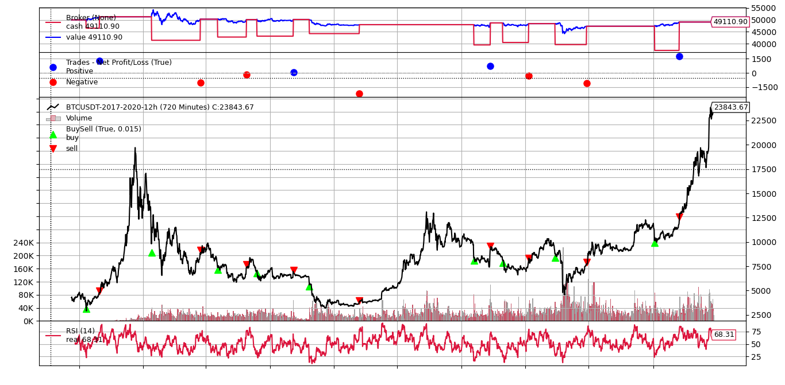
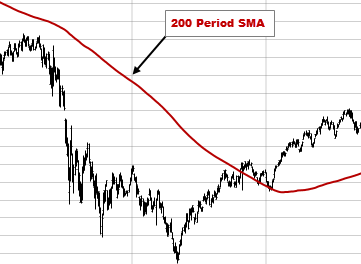

1. [Introduction and Roadmap](#introduction)
2. [Code review](#review)
    1. [Get candlesticks](#getdata)
    2. [Get results](#getresults)
    3. [Backtest](#backtest)
3. [Analysis](#analysis)


# Introduction and Roadmap <a name="introduction"></a>

First, our goal is to backtest several trading strategy on different cryptocurrencies and timeframes and rank them according their profit return. We won't bother developping a complex strategy, we will stick to basics ones using SMA and RSI relying on the Ta-Lib library and backtrader and we will vary the period used between 10 and 30. [backtesting code](backtest.py) | [requirements needed](requirements.txt)

The cryptocurrencies datas needed are collected through the Binance API. [code to get the wanted kandlesticks](get_data.py) | [file containing this datas](data/)

These datas will be processed by the [get_result.py](get_result.py) code that will run through all the datas in the data file and save the result in [result/](result/).

Finally the top 10 strategies will be saved to a [JSON file](top10sqn.json) so that we may reuse them.

&nbsp;

*Later, the algorithm will be adapted for trading futures and the strategies will be improved. The bot will then be connected to Binance and take automatic positions according the best strategy returned by the backtest.*

*Ideally, the backtest will run automatically each X period and reset the best strategy.*


# Code review <a name="review"></a>

## Get candlesticks <a name="getdata"></a>

To get the historical candlesticks we want for backtesting our strategies we use an [unofficial Python wrapper](https://python-binance.readthedocs.io/en/latest/) for the [Binance exchange REST API v3](https://github.com/binance/binance-spot-api-docs).

```
pip install python-binance
```

Then import the client and connect your Binance API key and API secret.

```python
from binance.client import Client
client = Client(config.API_KEY, config.API_SECRET)
```

You can then get the historical candlesticks you want by defining the cryptocurrency pair you want to get (BTCUSDT for example), the interval represented by one kandlesticks (1 month, 4h...) and its date.

```python
candlesticks = client.get_historical_klines("BTCUSDT", Client.KLINE_INTERVAL_4HOUR, "1 Jan, 2017", "25 Dec, 2020")
```

The datas we obtain are as follow :

```
[
  [
    1499040000000,      // Open time
    "0.01634790",       // Open
    "0.80000000",       // High
    "0.01575800",       // Low
    "0.01577100",       // Close
    "148976.11427815",  // Volume
    1499644799999,      // Close time
    "2434.19055334",    // Quote asset volume
    308,                // Number of trades
    "1756.87402397",    // Taker buy base asset volume
    "28.46694368",      // Taker buy quote asset volume
    "17928899.62484339" // Ignore.
  ]
]
```

Before saving these datas to a csv we need to divide the timestamp we obtain ('Open time') by 1000 to ignore the miliseconds.

We fetched the historical candlesticks for the **BTCUSDT** and **ETHUSDT** pairs for each **1w-3d-1d-12h-8h-6h-4h-2h-1h-30m-15m** timeframes.


## Get results <a name="getresults"></a>

The [get_result.py](get_result.py) code will basically set all the parameters we want to use on our [backtest.py](backtest.py) program and will run through all of them to get as many strategy and how they performed. For that we need to import our backtest code along with some others.

Next thing to do is to define the parameters we want to take into account.

```python
commission_val = 0.04 # 0.04% taker fees binance usdt futures
portofolio = 10000.0 # amount of money we start with
stake_val = 1
quantity = 0.10 # percentage to buy based on the current portofolio amount
# here it would correspond to a unit equivalent to 1000$ if the value of our portofolio didn't change

start = '2017-01-01'
end = '2020-12-31'
strategies = ['SMA', 'RSI']
periodRange = range(10, 31)
plot = False
```

In the ```strategies``` list we index all the strategies names written in the ```backtest``` code that we want to evaluate (the strategies names here are only indicators since we didn't write any complex strategy but only made simple use of these indicators), by default SMA and RSI use a period of 14 but we can also specify a range of values that we will use instead in order to test as many differents settings as we can to find the best ones.

If ```plot``` was set to ```True``` we would have a graphical view for each result :



This is the result of a simple strategy using RSI with a period 14 on the BTCUSDT pair with a timeframe for each candlesticks of 12h. We buy 1 unit if the rsi < 30 and we are not already in a position, and sell this unit when rsi > 70. We started with a portofolio of 50000 and ended up losing since our final value is 49110.90


We then loop through each strategy in each file and in each period, and we get in return additional details for each strategy such as the **portofolio final amount**, the **total number of wins and losses**, the **net profit and loss** and finally the **SQN value** which is an indicator designed to assist traders in determining the global quality of a trading system.

For that we call the ```runbacktest``` function imported from **backtest.py**.

```python
end_val, totalwin, totalloss, pnl_net, sqn = backtest.runbacktest(datapath, start, end, period, strategy, commission_val, portofolio, stake_val, quantity, plot)
```

At last, we save in differents files the result of each strategy as follow :

```
Pair,Timeframe,Start,End,Strategy,Period,Final value,%,Total win,Total loss,SQN
BTCUSDT,1h,2017-01-01,2020-12-31,SMA,10,8460.692,-15.478,663,2167,-1.64
BTCUSDT,1h,2017-01-01,2020-12-31,SMA,11,8531.827,-14.768,616,2082,-1.56
BTCUSDT,1h,2017-01-01,2020-12-31,SMA,12,8561.091,-14.551,574,2010,-1.54
...
BTCUSDT,1h,2017-01-01,2020-12-31,SMA,28,11423.668,14.121,283,1223,1.2
BTCUSDT,1h,2017-01-01,2020-12-31,SMA,29,11033.763,10.226,269,1226,0.88
BTCUSDT,1h,2017-01-01,2020-12-31,SMA,30,11023.452,10.123,265,1199,0.88
```

For example for this strategy ([SMA-BTCUSDT-20170101-20201231-1h.csv](result/SMA-BTCUSDT-20170101-20201231-1h.csv)) using SMA on the 1 hour timeframe BTCUSDT pair from 2017 to 2020, we can notice that the lower the SMA period is the lower our sqn and profit will be (in that case even negative), and conversely when the SMA period is higher our profit is better.

*The code was run again between 2018-03-01 and 2020-11-15 to exclude the bullrun period and test our strategies during upward trend and range period.*


## Backtest <a name="backtest"></a>

The [backtest.py](backtest.py) code was mostly based on the [Backtrader Quickstart Guide](https://www.backtrader.com/docu/quickstart/quickstart/). However, some modifications were applied and functionalities added to respond our needs.

**Two strategies were implemented :**

* Using SMA :

```python
class SMAStrategy(bt.Strategy):
    params = (
        ('maperiod', None),
        ('quantity', None)
    )
```

This strategy is based on the SMA indicator. If we are not already in a position and the closure price of the last candlestick is higher than the indicator (i.e. we cross the sma from bellow to top), then we buy a size equivalent to 10% of the current portofolio amount. We sell when the opposite happen.



```python
# Check if we are in the market
if not self.position:
    # Not yet ... we MIGHT BUY if ...
    if self.dataclose[0] > self.sma[0]:
        # Keep track of the created order to avoid a 2nd order
        self.amount = (self.broker.getvalue() * self.params.quantity) / self.dataclose[0]
        self.order = self.buy(size=self.amount)
else:
    # Already in the market ... we might sell
    if self.dataclose[0] < self.sma[0]:
        # Keep track of the created order to avoid a 2nd order
        self.order = self.sell(size=self.amount)
```

* Using RSI :

```python
class RSIStrategy(bt.Strategy):
    params = (
        ('maperiod', None),
        ('quantity', None)
    )
```

Based on the RSI indicator, if we are not already in a position and the rsi go below 30 then we buy a size equivalent to 10% of the current portofolio amount that we will sell when rsi > 70.

```python
# Check if we are in the market
if not self.position:
    # Not yet ... we MIGHT BUY if ...
    if self.rsi < 30:
        # Keep track of the created order to avoid a 2nd order
        self.amount = (self.broker.getvalue() * self.params.quantity) / self.dataclose[0]
        self.order = self.buy(size=self.amount)
else:
    # Already in the market ... we might sell
    if self.rsi > 70:
        # Keep track of the created order to avoid a 2nd order
        self.order = self.sell(size=self.amount)
```

* Strategy selection

Depending on the parameter given in the ```runbacktest``` function we will add one of the two strategy we have written and give it the period we want to use and quantity in % of our portofolio that we want to use.

```python
if strategy == 'SMA':
    cerebro.addstrategy(SMAStrategy, maperiod=period, quantity=quantity)
elif strategy == 'RSI':
    cerebro.addstrategy(RSIStrategy, maperiod=period, quantity=quantity)
else :
    print('no strategy')
    exit()
```

&nbsp;

* Get compression and timeframe

When we create the data feed we need to define the compression and timeframe.

```python
data = bt.feeds.GenericCSVData(
        dataname = datapath,
        dtformat = 2, 
        compression = compression, 
        timeframe = timeframe,
        fromdate = datetime.datetime.strptime(start, '%Y-%m-%d'),
        todate = datetime.datetime.strptime(end, '%Y-%m-%d'),
        reverse = False)

cerebro.adddata(data)
```

For a 3 days timeframe (one candlestick represent 3 days) we would have ```compression = 3``` and ```timeframe = bt.TimeFrame.Days```. However, for a 2h timeframe ```compression = 120``` but ```timeframe = bt.TimeFrame.Minutes```.

To automatically do this conversion the ```runbacktest()``` function will analyse the given datapath name and pass it to another function that will read the file name and retrieve its timeframe (e.g. data/ETHUSDT-2017-2020-**4h**.csv).

```python
def timeFrame(datapath):
    """
    Select the write compression and timeframe.
    """
    sepdatapath = datapath[5:-4].split(sep='-') # ignore name file 'data/' and '.csv'
    tf = sepdatapath[3]

    if tf == '1mth':
        compression = 1
        timeframe = bt.TimeFrame.Months
    elif tf == '12h':
        compression = 720
        timeframe = bt.TimeFrame.Minutes
    
    ...

    elif tf == '8h':
        compression = 480
        timeframe = bt.TimeFrame.Minutes
    else:
        print('dataframe not recognized')
        exit()

    return compression, timeframe
```

*Later this function can be improved to save more lines by autocomputing the compression if we have a hour timeframe (e.g. if 'h' take what's in the front, say 12 and multiply it by 60 => 720 and timeframe = bt.TimeFrame.Minutes).*

&nbsp;


# Analysis <a name="analysis"></a>

Find the analysis in [README.ipynb](README.ipynb) notebook.